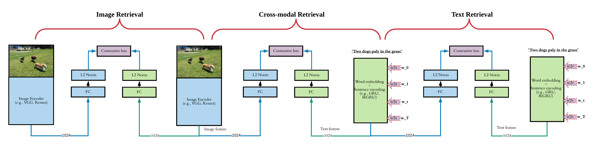
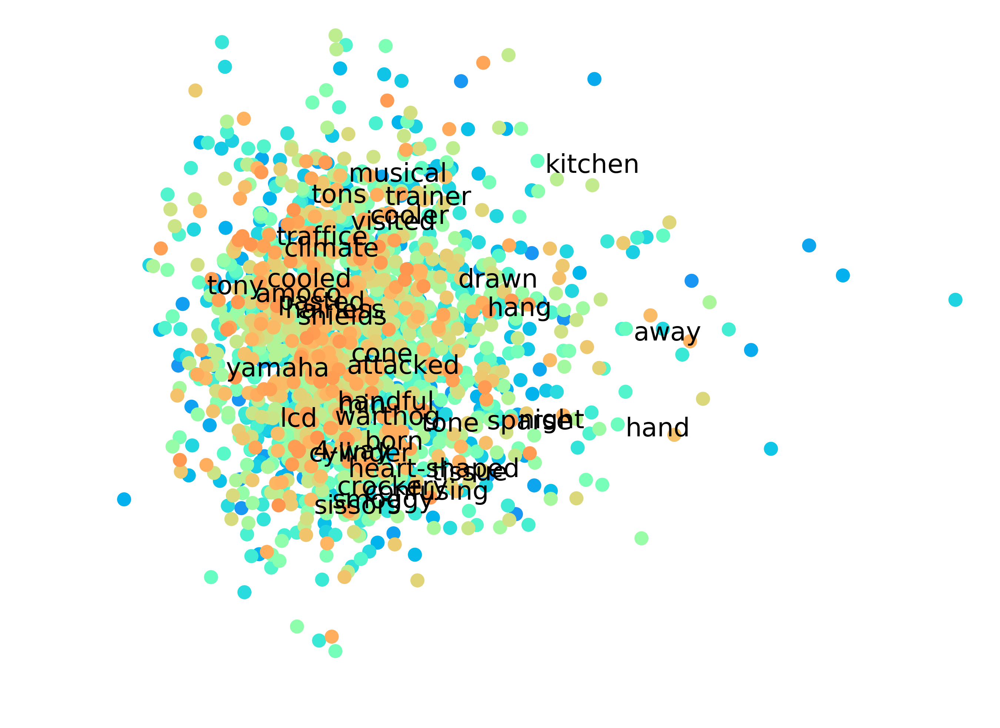

# Single-Modal and Cross-Modal Retrieval Tasks



## Dependencies
We recommended to use Anaconda for the following packages: Python 2.7, [PyTorch](http://pytorch.org/) (>0.1.12), [NumPy](http://www.numpy.org/) (>1.12.1),  [TensorBoard](https://github.com/TeamHG-Memex/tensorboard_logger)

* Punkt Sentence Tokenizer:
```python
import nltk
nltk.download()
> d punkt
```

## Download data
In this exeripments, we used MSCOCO image-caption as the dataset, for single model (image or text), you can only use image/text as the training data, corss-modal retrieval shares the same framework with single modal retrieval. You can download the data from MSCOCO image captioning website, or download the precomputed image features are from [here](https://github.com/ryankiros/visual-semantic-embedding/) and [here](https://github.com/ivendrov/order-embedding). To use full image encoders, download the images from their original sources [here](http://nlp.cs.illinois.edu/HockenmaierGroup/Framing_Image_Description/KCCA.html), [here](http://shannon.cs.illinois.edu/DenotationGraph/) and [here](http://mscoco.org/).

```bash
wget http://www.cs.toronto.edu/~faghri/vsepp/vocab.tar
wget http://www.cs.toronto.edu/~faghri/vsepp/data.tar
wget http://www.cs.toronto.edu/~faghri/vsepp/runs.tar
```

We refer to the path of extracted files for `data.tar` as `$DATA_PATH` and
files for `models.tar` as `$RUN_PATH`. Extract `vocab.tar` to `./vocab`
directory.

## Training
Run `train.sh`:

```bash
python train.sh 0
```

## Evaluation

```python
from vocab import Vocabulary
import evaluation
evaluation.evalrank("run/gru_cross_nlp/model_best.pth.tar", data_path="$DATA_PATH", split="test")'
```

## Visualize Word Embeddings
```
python visualize_w2v.py
```


## Reference
```
@article{gu2017look,
  title={Look, Imagine and Match: Improving Textual-Visual Cross-Modal Retrieval with Generative Models},
  author={Gu, Jiuxiang and Cai, Jianfei and Joty, Shafiq and Niu, Li and Wang, Gang},
  journal={CVPR},
  year={2018}
}
```
